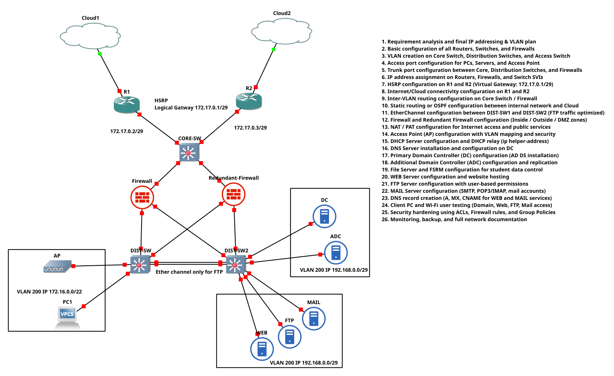

# Enterprise Network Infrastructure Project

<div align="center">


**A comprehensive enterprise-grade network architecture featuring redundancy, security, and scalability**

[Overview](#-network-topology-overview) •
[Configuration](#-configuration-guide) •
[Deployment](#-deployment-checklist) •
[Troubleshooting](#-troubleshooting-guide)

---

</div>

## 📷 Network Diagram

<div align="center">



*Enterprise Network Topology with Dual WAN, HSRP, and Segmented VLANs*

</div>

---

## 📌 Network Topology Overview

<table>
<tr>
<td width="50%">

### 🌐 Core Features
- ✅ Dual Internet/Cloud connectivity
- ✅ Redundant routers using **HSRP**
- ✅ Core, Distribution, and Access layers
- ✅ Redundant firewalls with failover
- ✅ EtherChannel for high-speed FTP traffic

</td>
<td width="50%">

### 🏢 Infrastructure
- ✅ Centralized server infrastructure
- ✅ VLAN-based segmentation
- ✅ Wired and Wireless client access
- ✅ 802.1X authentication
- ✅ Active Directory integration

</td>
</tr>
</table>

---

## 🧩 Implementation Phases

<details>
<summary><b>📋 Phase 1: Planning & Base Setup</b></summary>

| Step | Task | Status |
|:----:|------|:------:|
| 1 | Requirement analysis and final IP addressing & VLAN design | ⬜ |
| 2 | Basic configuration of all Routers, Switches, and Firewalls | ⬜ |
| 3 | VLAN creation on Core Switch, Distribution Switches, and Access Switches | ⬜ |
| 4 | Access port configuration for PCs, Servers, and Access Points | ⬜ |
| 5 | Trunk port configuration between Core, Distribution Switches, and Firewalls | ⬜ |

</details>

<details>
<summary><b>🔄 Phase 2: Routing & Redundancy</b></summary>

| Step | Task | Status |
|:----:|------|:------:|
| 6 | IP address assignment on Routers, Firewalls, and Switch SVIs | ⬜ |
| 7 | HSRP configuration on R1 and R2 (Virtual Gateway: `172.17.0.1/29`) | ⬜ |
| 8 | Internet/Cloud connectivity configuration on R1 and R2 | ⬜ |
| 9 | Inter-VLAN routing configuration on Core Switch or Firewall | ⬜ |
| 10 | Static Routing or OSPF configuration between internal network and Cloud | ⬜ |

</details>

<details>
<summary><b>🔀 Phase 3: Switching Optimization</b></summary>

| Step | Task | Status |
|:----:|------|:------:|
| 11 | EtherChannel configuration between `DIST-SW1` and `DIST-SW2` | ⬜ |

> **Note:** EtherChannel optimized for FTP traffic providing high throughput and redundancy

</details>

<details>
<summary><b>🛡️ Phase 4: Security Layer</b></summary>

| Step | Task | Status |
|:----:|------|:------:|
| 12 | Firewall and Redundant Firewall configuration (Inside/Outside/DMZ zones) | ⬜ |
| 13 | NAT/PAT configuration for Internet access and public services | ⬜ |
| 14 | Access Control using Firewall policies and ACLs | ⬜ |

</details>

<details>
<summary><b>📡 Phase 5: Wireless & Client Services</b></summary>

| Step | Task | Status |
|:----:|------|:------:|
| 15 | Access Point configuration (SSID, VLAN mapping, WPA2/WPA3) | ⬜ |
| 16 | DHCP Server configuration with relay (`ip helper-address`) | ⬜ |

</details>

<details>
<summary><b>🖥️ Phase 6: Core Server Infrastructure</b></summary>

| Step | Task | Status |
|:----:|------|:------:|
| 17 | DNS Server installation and configuration | ⬜ |
| 18 | Primary Domain Controller (DC) with AD DS | ⬜ |
| 19 | Additional Domain Controller (ADC) for replication | ⬜ |
| 20 | File Server & FSRM configuration | ⬜ |

</details>

<details>
<summary><b>🌍 Phase 7: Application & Hosting Services</b></summary>

| Step | Task | Status |
|:----:|------|:------:|
| 21 | Web Server configuration and website hosting | ⬜ |
| 22 | FTP Server configuration with user-based permissions | ⬜ |
| 23 | Mail Server configuration (SMTP, POP3/IMAP) | ⬜ |
| 24 | DNS record creation (A, MX, CNAME records) | ⬜ |

</details>

<details>
<summary><b>✅ Phase 8: Testing & Hardening</b></summary>

| Step | Task | Status |
|:----:|------|:------:|
| 25 | Client PC and Wi-Fi user testing (Domain login, Web, FTP, Mail) | ⬜ |
| 26 | Security hardening (ACLs, Firewall rules, Group Policies) | ⬜ |
| 27 | Monitoring, backup, and full network documentation | ⬜ |

</details>

---

## 🚀 Technologies Used

<div align="center">

| Category | Technologies |
|----------|-------------|
| **Networking** | Cisco IOS, HSRP, VLAN, Trunking, EtherChannel, OSPF |
| **Security** | Cisco ASA/Firewall, NAT/PAT, ACLs, 802.1X, IPS/IDS |
| **Server** | Windows Server (AD DS, DNS, DHCP, FSRM, NPS) |
| **Web Hosting** | IIS / Apache / Nginx |
| **Services** | FTP, SMTP, POP3, IMAP |
| **Wireless** | WPA2/WPA3-Enterprise, RADIUS |

</div>

---

## 📋 IP Addressing Plan

### 🔹 Management & Routing

| Device | Interface | IP Address | Subnet Mask | Role |
|--------|-----------|------------|-------------|------|
| HSRP VIP | - | `172.17.0.1` | /29 | Virtual Gateway |
| R1 | Gi0/1 | `172.17.0.2` | /29 | Active Router |
| R2 | Gi0/1 | `172.17.0.3` | /29 | Standby Router |
| CORE-SW | Gi0/1 | `172.17.0.4` | /29 | Core Switch |

### 🔹 VLAN Configuration

| VLAN ID | Name | Subnet | Gateway | Hosts | Purpose |
|:-------:|------|--------|---------|:-----:|---------|
| 200 | CLIENT_NETWORK | `172.16.0.0/22` | `172.16.0.1` | 1022 | Students, AP, PCs |
| 201 | SERVER_NETWORK | `192.168.0.0/24` | `192.168.0.1` | 254 | DC, ADC, WEB, FTP, MAIL |
| 999 | NATIVE_VLAN | - | - | - | Trunk Native VLAN |

### 🔹 Server IP Assignments

| Server | IP Address | Gateway | VLAN | Service |
|--------|------------|---------|:----:|---------|
| DC | `192.168.0.2` | `192.168.0.1` | 201 | Domain Controller, DNS, NPS |
| ADC | `192.168.0.3` | `192.168.0.1` | 201 | Additional Domain Controller |
| WEB | `192.168.0.10` | `192.168.0.1` | 201 | Web Server (IIS/Apache) |
| FTP | `192.168.0.11` | `192.168.0.1` | 201 | FTP Server |
| MAIL | `192.168.0.12` | `192.168.0.1` | 201 | Mail Server (SMTP/IMAP/POP3) |

---

## 🔧 Configuration Guide

### 📍 1. Edge Router Configuration

<details>
<summary><b>Router R1 (Active HSRP Gateway)</b></summary>

```cisco
enable
configure terminal
hostname R1

! WAN Interface to Cloud1
interface GigabitEthernet0/0
 description WAN_to_Cloud1
 ip address dhcp
 ip nat outside
 no shutdown
exit

! LAN Interface to Core Switch
interface GigabitEthernet0/1
 description LAN_to_CORE-SW
 ip address 172.17.0.2 255.255.255.248
 ip nat inside
 no shutdown
 
 ! HSRP Configuration
 standby version 2
 standby 1 ip 172.17.0.1
 standby 1 priority 110
 standby 1 preempt
 standby 1 authentication md5 key-string hsrp_secret
exit

! Static Default Route
ip route 0.0.0.0 0.0.0.0 GigabitEthernet0/0

! NAT Configuration for Internet Access
access-list 10 permit 172.16.0.0 0.0.3.255
access-list 10 permit 192.168.0.0 0.0.0.255
ip nat inside source list 10 interface GigabitEthernet0/0 overload

! OSPF Configuration
router ospf 1
 router-id 1.1.1.1
 network 172.17.0.0 0.0.0.7 area 0
 passive-interface GigabitEthernet0/0
 default-information originate
exit

! DNS Configuration
ip domain-lookup
ip name-server 192.168.0.2
ip name-server 8.8.8.8

end
write memory
```

</details>

<details>
<summary><b>Router R2 (Standby HSRP Gateway)</b></summary>

```cisco
enable
configure terminal
hostname R2

! WAN Interface to Cloud2
interface GigabitEthernet0/0
 description WAN_to_Cloud2
 ip address dhcp
 ip nat outside
 no shutdown
exit

! LAN Interface to Core Switch
interface GigabitEthernet0/1
 description LAN_to_CORE-SW
 ip address 172.17.0.3 255.255.255.248
 ip nat inside
 no shutdown
 
 ! HSRP Configuration
 standby version 2
 standby 1 ip 172.17.0.1
 standby 1 priority 100
 standby 1 preempt
 standby 1 authentication md5 key-string hsrp_secret
exit

! Static Default Route
ip route 0.0.0.0 0.0.0.0 GigabitEthernet0/0

! NAT Configuration
access-list 10 permit 172.16.0.0 0.0.3.255
access-list 10 permit 192.168.0.0 0.0.0.255
ip nat inside source list 10 interface GigabitEthernet0/0 overload

! OSPF Configuration
router ospf 1
 router-id 2.2.2.2
 network 172.17.0.0 0.0.0.7 area 0
 passive-interface GigabitEthernet0/0
 default-information originate
exit

! DNS Configuration
ip domain-lookup
ip name-server 192.168.0.2
ip name-server 8.8.8.8

end
write memory
```

</details>

---

### 📍 2. Core Switch Configuration (Layer 3)

<details>
<summary><b>Click to expand CORE-SW configuration</b></summary>

```cisco
enable
configure terminal
hostname CORE-SW

! Enable IP Routing
ip routing

! VLAN Creation
vlan 200
 name CLIENT_NETWORK
exit
vlan 201
 name SERVER_NETWORK
exit
vlan 999
 name NATIVE_VLAN
exit

! SVI Configuration (Gateway Interfaces)
interface Vlan200
 description Gateway_for_Clients_and_AP
 ip address 172.16.0.1 255.255.252.0
 ip helper-address 172.17.0.1
 no shutdown
exit

interface Vlan201
 description Gateway_for_Servers
 ip address 192.168.0.1 255.255.255.0
 no shutdown
exit

! Uplink to R1
interface GigabitEthernet0/1
 description Uplink_to_R1
 no switchport
 ip address 172.17.0.4 255.255.255.248
 no shutdown
exit

! Uplink to R2
interface GigabitEthernet0/2
 description Uplink_to_R2
 no switchport
 ip address 172.17.0.5 255.255.255.248
 no shutdown
exit

! Trunk to Firewall
interface GigabitEthernet0/3
 description Trunk_to_Firewall
 switchport trunk encapsulation dot1q
 switchport mode trunk
 switchport trunk native vlan 999
 switchport trunk allowed vlan 200,201
 no shutdown
exit

! Trunk to Redundant-Firewall
interface GigabitEthernet0/4
 description Trunk_to_Redundant_Firewall
 switchport trunk encapsulation dot1q
 switchport mode trunk
 switchport trunk native vlan 999
 switchport trunk allowed vlan 200,201
 no shutdown
exit

! Trunk to DIST-SW1 (EtherChannel)
interface GigabitEthernet0/5
 description Trunk_to_DIST-SW1
 switchport trunk encapsulation dot1q
 switchport mode trunk
 switchport trunk native vlan 999
 switchport trunk allowed vlan 200,201
 channel-group 1 mode active
 no shutdown
exit

! Trunk to DIST-SW2 (EtherChannel)
interface GigabitEthernet0/6
 description Trunk_to_DIST-SW2
 switchport trunk encapsulation dot1q
 switchport mode trunk
 switchport trunk native vlan 999
 switchport trunk allowed vlan 200,201
 channel-group 2 mode active
 no shutdown
exit

! EtherChannel Configuration
interface Port-channel1
 description EtherChannel_to_DIST-SW1
 switchport trunk encapsulation dot1q
 switchport mode trunk
 switchport trunk native vlan 999
exit

interface Port-channel2
 description EtherChannel_to_DIST-SW2
 switchport trunk encapsulation dot1q
 switchport mode trunk
 switchport trunk native vlan 999
exit

! OSPF Configuration
router ospf 1
 router-id 3.3.3.3
 network 172.17.0.0 0.0.0.7 area 0
 network 172.16.0.0 0.0.3.255 area 0
 network 192.168.0.0 0.0.0.255 area 0
exit

! DHCP Server Configuration
ip dhcp excluded-address 172.16.0.1 172.16.0.10
ip dhcp excluded-address 192.168.0.1 192.168.0.5

ip dhcp pool CLIENT_POOL
 network 172.16.0.0 255.255.252.0
 default-router 172.16.0.1
 dns-server 192.168.0.2 8.8.8.8
 domain-name example.local
 lease 7
exit

! Spanning Tree Configuration
spanning-tree mode rapid-pvst
spanning-tree vlan 200,201 priority 4096

end
write memory
```

</details>

---

### 📍 3. Firewall Configuration

<details>
<summary><b>Primary Firewall</b></summary>

```cisco
enable
configure terminal
hostname FIREWALL

! VLAN Configuration
vlan 200
 name CLIENT_NETWORK
exit
vlan 201
 name SERVER_NETWORK
exit
vlan 100
 name DMZ
exit

! Inside Interface (Client Network)
interface Vlan200
 description Inside_Network
 ip address 172.16.0.254 255.255.252.0
 security-level 100
 no shutdown
exit

! DMZ Interface (Server Network)
interface Vlan201
 description DMZ_Server_Network
 ip address 192.168.0.254 255.255.255.0
 security-level 50
 no shutdown
exit

! Outside Interface
interface GigabitEthernet0/0
 description Outside_to_CORE
 nameif outside
 security-level 0
 ip address 172.17.0.10 255.255.255.248
 no shutdown
exit

! Access Control Lists
! Allow Clients to DC/ADC for Authentication
access-list INSIDE_IN extended permit tcp 172.16.0.0 255.255.252.0 host 192.168.0.2 eq domain
access-list INSIDE_IN extended permit udp 172.16.0.0 255.255.252.0 host 192.168.0.2 eq domain
access-list INSIDE_IN extended permit tcp 172.16.0.0 255.255.252.0 host 192.168.0.2 eq ldap
access-list INSIDE_IN extended permit tcp 172.16.0.0 255.255.252.0 host 192.168.0.2 eq 88
access-list INSIDE_IN extended permit tcp 172.16.0.0 255.255.252.0 host 192.168.0.3 eq ldap

! Allow Clients to WEB Server
access-list INSIDE_IN extended permit tcp 172.16.0.0 255.255.252.0 host 192.168.0.10 eq www
access-list INSIDE_IN extended permit tcp 172.16.0.0 255.255.252.0 host 192.168.0.10 eq https

! Allow Clients to MAIL Server
access-list INSIDE_IN extended permit tcp 172.16.0.0 255.255.252.0 host 192.168.0.12 eq smtp
access-list INSIDE_IN extended permit tcp 172.16.0.0 255.255.252.0 host 192.168.0.12 eq pop3
access-list INSIDE_IN extended permit tcp 172.16.0.0 255.255.252.0 host 192.168.0.12 eq imap

! Block Clients from FTP (only admin access)
access-list INSIDE_IN extended deny tcp 172.16.0.0 255.255.252.0 host 192.168.0.11 eq ftp

! Allow all other Internet traffic
access-list INSIDE_IN extended permit ip 172.16.0.0 255.255.252.0 any

! Apply ACL
access-group INSIDE_IN in interface Vlan200

! NAT Configuration (PAT)
object network INSIDE_NET
 subnet 172.16.0.0 255.255.252.0
 nat (inside,outside) dynamic interface

! Static NAT for Public Services
static (dmz,outside) tcp interface www 192.168.0.10 www
static (dmz,outside) tcp interface https 192.168.0.10 https
static (dmz,outside) tcp interface smtp 192.168.0.12 smtp

! IPS/IDS Configuration
ip audit name IDS_POLICY attack action alarm drop reset
ip audit interface Vlan200 IDS_POLICY

! Route to Internet via CORE
route outside 0.0.0.0 0.0.0.0 172.17.0.1 1

end
write memory
```

</details>

<details>
<summary><b>Redundant Firewall (Failover)</b></summary>

```cisco
enable
configure terminal
hostname REDUNDANT-FIREWALL

! Enable Failover
failover
failover lan unit secondary
failover lan interface FAILOVER GigabitEthernet0/3
failover interface ip FAILOVER 10.10.10.2 255.255.255.252 standby 10.10.10.1

! Continue with similar configuration as Primary...
```

</details>

---

### 📍 4. Distribution Switch Configuration

<details>
<summary><b>DIST-SW1</b></summary>

```cisco
enable
configure terminal
hostname DIST-SW1

! VLAN Configuration
vlan 200
 name CLIENT_NETWORK
exit
vlan 201
 name SERVER_NETWORK
exit

! Trunk to CORE-SW
interface GigabitEthernet0/1
 description Trunk_to_CORE-SW
 switchport trunk encapsulation dot1q
 switchport mode trunk
 switchport trunk native vlan 999
 channel-group 1 mode active
 no shutdown
exit

! FTP EtherChannel (Dedicated for FTP Traffic)
interface range GigabitEthernet0/2-3
 description EtherChannel_to_DIST-SW2_FTP_Only
 switchport trunk encapsulation dot1q
 switchport mode trunk
 switchport trunk allowed vlan 201
 channel-group 10 mode active
 no shutdown
exit

interface Port-channel10
 description FTP_EtherChannel
 switchport trunk encapsulation dot1q
 switchport mode trunk
 switchport trunk allowed vlan 201
exit

! Trunk to Firewall
interface GigabitEthernet0/4
 description Trunk_to_Firewall
 switchport trunk encapsulation dot1q
 switchport mode trunk
 no shutdown
exit

! Access Ports to AP
interface FastEthernet0/1
 description Access_to_AP
 switchport mode access
 switchport access vlan 200
 spanning-tree portfast
 spanning-tree bpduguard enable
 no shutdown
exit

! Access Port to PC1
interface FastEthernet0/2
 description Access_to_PC1
 switchport mode access
 switchport access vlan 200
 spanning-tree portfast
 spanning-tree bpduguard enable
 no shutdown
exit

! Spanning Tree Configuration
spanning-tree mode rapid-pvst
spanning-tree vlan 200 priority 8192
spanning-tree vlan 201 priority 12288

end
write memory
```

</details>

<details>
<summary><b>DIST-SW2</b></summary>

```cisco
enable
configure terminal
hostname DIST-SW2

! VLAN Configuration
vlan 200
 name CLIENT_NETWORK
exit
vlan 201
 name SERVER_NETWORK
exit

! Trunk to CORE-SW
interface GigabitEthernet0/1
 description Trunk_to_CORE-SW
 switchport trunk encapsulation dot1q
 switchport mode trunk
 switchport trunk native vlan 999
 channel-group 2 mode active
 no shutdown
exit

! FTP EtherChannel
interface range GigabitEthernet0/2-3
 description EtherChannel_to_DIST-SW1_FTP_Only
 switchport trunk encapsulation dot1q
 switchport mode trunk
 switchport trunk allowed vlan 201
 channel-group 10 mode active
 no shutdown
exit

! Trunk to Redundant Firewall
interface GigabitEthernet0/4
 description Trunk_to_Redundant_Firewall
 switchport trunk encapsulation dot1q
 switchport mode trunk
 no shutdown
exit

! Access Ports to Servers (VLAN 201)
interface FastEthernet0/1
 description Access_to_DC
 switchport mode access
 switchport access vlan 201
 spanning-tree portfast
 no shutdown
exit

interface FastEthernet0/2
 description Access_to_ADC
 switchport mode access
 switchport access vlan 201
 spanning-tree portfast
 no shutdown
exit

interface FastEthernet0/3
 description Access_to_WEB_Server
 switchport mode access
 switchport access vlan 201
 spanning-tree portfast
 no shutdown
exit

interface FastEthernet0/4
 description Access_to_FTP_Server
 switchport mode access
 switchport access vlan 201
 spanning-tree portfast
 no shutdown
exit

interface FastEthernet0/5
 description Access_to_MAIL_Server
 switchport mode access
 switchport access vlan 201
 spanning-tree portfast
 no shutdown
exit

! Spanning Tree Configuration
spanning-tree mode rapid-pvst
spanning-tree vlan 200 priority 12288
spanning-tree vlan 201 priority 8192

end
write memory
```

</details>

---

### 📍 5. Access Point Configuration

<details>
<summary><b>Wireless AP (802.1X)</b></summary>

```cisco
enable
configure terminal
hostname AP

! Management IP (will get from DHCP)
interface BVI1
 ip address dhcp
exit

! Radio Interface
dot11 ssid Student_Network
 vlan 200
 authentication open eap eap_methods
 authentication key-management wpa version 2
 mbssid guest-mode
exit

! 802.1X Configuration
dot11 aaa authentication ssid Student_Network
dot11 aaa authorization ssid Student_Network

! RADIUS Server Configuration
radius-server host 192.168.0.2 auth-port 1812 acct-port 1813 key RadiusSecret123

! AAA Configuration
aaa new-model
aaa group server radius RAD_GROUP
 server 192.168.0.2 auth-port 1812 acct-port 1813
exit

aaa authentication login eap_methods group RAD_GROUP
aaa authorization exec default group RAD_GROUP

! Bridge to Ethernet
interface Dot11Radio0
 encryption vlan 200 mode ciphers aes-ccm
 ssid Student_Network
 no shutdown
exit

interface GigabitEthernet0
 description Trunk_to_DIST-SW1
 switchport mode trunk
 switchport trunk allowed vlan 200
exit

end
write memory
```

</details>

---

### 📍 6. Server Configurations

<details>
<summary><b>🖥️ Domain Controller (DC) - Windows Server</b></summary>

**IP Configuration:**
- IP Address: `192.168.0.2/24`
- Gateway: `192.168.0.1`
- DNS: `127.0.0.1`, `8.8.8.8`

```powershell
# Set Static IP
New-NetIPAddress -InterfaceAlias "Ethernet" -IPAddress 192.168.0.2 -PrefixLength 24 -DefaultGateway 192.168.0.1
Set-DnsClientServerAddress -InterfaceAlias "Ethernet" -ServerAddresses 127.0.0.1,8.8.8.8

# Install AD DS Role
Install-WindowsFeature -Name AD-Domain-Services -IncludeManagementTools

# Promote to Domain Controller
Install-ADDSForest `
  -DomainName "example.local" `
  -DomainNetbiosName "EXAMPLE" `
  -InstallDns `
  -SafeModeAdministratorPassword (ConvertTo-SecureString "P@ssw0rd123!" -AsPlainText -Force) `
  -Force

# Install NPS (RADIUS Server)
Install-WindowsFeature -Name NPAS -IncludeManagementTools

# Add DNS Records
Add-DnsServerResourceRecordA -Name "web" -ZoneName "example.local" -IPv4Address "192.168.0.10"
Add-DnsServerResourceRecordA -Name "ftp" -ZoneName "example.local" -IPv4Address "192.168.0.11"
Add-DnsServerResourceRecordA -Name "mail" -ZoneName "example.local" -IPv4Address "192.168.0.12"
Add-DnsServerResourceRecordMX -Name "." -ZoneName "example.local" -MailExchange "mail.example.local" -Preference 10
Add-DnsServerResourceRecordCName -Name "www" -ZoneName "example.local" -HostNameAlias "web.example.local"
```

</details>

<details>
<summary><b>🖥️ Additional Domain Controller (ADC)</b></summary>

**IP Configuration:**
- IP Address: `192.168.0.3/24`
- Gateway: `192.168.0.1`
- DNS: `192.168.0.2`, `127.0.0.1`

```powershell
# Set Static IP
New-NetIPAddress -InterfaceAlias "Ethernet" -IPAddress 192.168.0.3 -PrefixLength 24 -DefaultGateway 192.168.0.1
Set-DnsClientServerAddress -InterfaceAlias "Ethernet" -ServerAddresses 192.168.0.2,127.0.0.1

# Join Domain and Promote to DC
Install-WindowsFeature -Name AD-Domain-Services -IncludeManagementTools

Install-ADDSDomainController `
  -DomainName "example.local" `
  -InstallDns `
  -Credential (Get-Credential) `
  -SafeModeAdministratorPassword (ConvertTo-SecureString "P@ssw0rd123!" -AsPlainText -Force) `
  -Force
```

</details>

<details>
<summary><b>🌐 WEB Server Configuration</b></summary>

**IP Configuration:**
- IP: `192.168.0.10/24`
- Gateway: `192.168.0.1`
- DNS: `192.168.0.2`

**Windows (IIS):**
```powershell
# Install IIS
Install-WindowsFeature -Name Web-Server -IncludeManagementTools

# Configure Default Website
Import-Module WebAdministration
New-Item -Path "C:\inetpub\wwwroot\index.html" -ItemType File -Value "<h1>Welcome to Corporate Website</h1>"

# Enable HTTPS
New-SelfSignedCertificate -DnsName "web.example.local" -CertStoreLocation "cert:\LocalMachine\My"
```

**Linux (Apache):**
```bash
# Ubuntu/Debian
sudo apt update
sudo apt install apache2 -y

# Configure Network
sudo nano /etc/netplan/00-installer-config.yaml
# Add:
# network:
#   ethernets:
#     ens33:
#       addresses: [192.168.0.10/24]
#       gateway4: 192.168.0.1
#       nameservers:
#         addresses: [192.168.0.2, 8.8.8.8]

sudo netplan apply
sudo systemctl start apache2
sudo systemctl enable apache2
```

</details>

<details>
<summary><b>📁 FTP Server Configuration</b></summary>

**IP Configuration:** `192.168.0.11/24`

**Windows:**
```powershell
# Install FTP Server
Install-WindowsFeature -Name Web-FTP-Server -IncludeManagementTools

# Create FTP Site
Import-Module WebAdministration
New-WebFtpSite -Name "Corporate FTP" -Port 21 -PhysicalPath "C:\FTPRoot"
```

**Linux (vsftpd):**
```bash
sudo apt install vsftpd -y

# Configure vsftpd
sudo nano /etc/vsftpd.conf
# Edit:
# anonymous_enable=NO
# local_enable=YES
# write_enable=YES
# chroot_local_user=YES

sudo systemctl restart vsftpd
```

</details>

<details>
<summary><b>📧 MAIL Server Configuration</b></summary>

**IP Configuration:** `192.168.0.12/24`

**Linux (Postfix + Dovecot):**
```bash
# Install Postfix and Dovecot
sudo apt install postfix dovecot-core dovecot-imapd dovecot-pop3d -y

# Configure Postfix
sudo nano /etc/postfix/main.cf
# Edit:
# myhostname = mail.example.local
# mydomain = example.local
# myorigin = $mydomain
# inet_interfaces = all
# mydestination = $myhostname, localhost.$mydomain, localhost, $mydomain

# Configure Dovecot
sudo nano /etc/dovecot/dovecot.conf
# Uncomment: protocols = imap pop3

sudo systemctl restart postfix dovecot
```

</details>

---

### 📍 7. Security Hardening

<details>
<summary><b>🔒 ACL for Student Data Control</b></summary>

```cisco
! On CORE-SW or Firewall

ip access-list extended STUDENT_CONTROL
 
 ! Allow DNS to DC
 permit udp 172.16.0.0 0.0.3.255 host 192.168.0.2 eq domain
 permit tcp 172.16.0.0 0.0.3.255 host 192.168.0.2 eq domain
 
 ! Allow LDAP/Kerberos for Authentication
 permit tcp 172.16.0.0 0.0.3.255 host 192.168.0.2 eq ldap
 permit tcp 172.16.0.0 0.0.3.255 host 192.168.0.2 eq 88
 permit tcp 172.16.0.0 0.0.3.255 host 192.168.0.3 eq ldap
 
 ! Allow HTTP/HTTPS to WEB Server
 permit tcp 172.16.0.0 0.0.3.255 host 192.168.0.10 eq www
 permit tcp 172.16.0.0 0.0.3.255 host 192.168.0.10 eq https
 
 ! Allow Email Access
 permit tcp 172.16.0.0 0.0.3.255 host 192.168.0.12 eq smtp
 permit tcp 172.16.0.0 0.0.3.255 host 192.168.0.12 eq pop3
 permit tcp 172.16.0.0 0.0.3.255 host 192.168.0.12 eq imap
 
 ! DENY FTP Access (Only for authorized users)
 deny tcp 172.16.0.0 0.0.3.255 host 192.168.0.11 eq ftp log
 
 ! Allow Internet Access (HTTP/HTTPS only)
 permit tcp 172.16.0.0 0.0.3.255 any eq www
 permit tcp 172.16.0.0 0.0.3.255 any eq https
 permit tcp 172.16.0.0 0.0.3.255 any eq 8080
 
 ! Deny everything else
 deny ip any any log

! Apply ACL
interface Vlan200
 ip access-group STUDENT_CONTROL in
```

</details>

<details>
<summary><b>🔥 Firewall Zone Rules</b></summary>

```cisco
! Inside Zone → DMZ Zone
access-list INSIDE_TO_DMZ extended permit tcp 172.16.0.0 255.255.252.0 192.168.0.0 255.255.255.0 eq www
access-list INSIDE_TO_DMZ extended permit tcp 172.16.0.0 255.255.252.0 192.168.0.0 255.255.255.0 eq https
access-list INSIDE_TO_DMZ extended permit tcp 172.16.0.0 255.255.252.0 192.168.0.0 255.255.255.0 eq smtp
access-list INSIDE_TO_DMZ extended deny ip any any

! Outside Zone → DMZ Zone (Public Access)
access-list OUTSIDE_TO_DMZ extended permit tcp any host 192.168.0.10 eq www
access-list OUTSIDE_TO_DMZ extended permit tcp any host 192.168.0.10 eq https
access-list OUTSIDE_TO_DMZ extended permit tcp any host 192.168.0.12 eq smtp
access-list OUTSIDE_TO_DMZ extended deny ip any any

! DMZ → Inside (Restricted)
access-list DMZ_TO_INSIDE extended deny ip any any
```

</details>

<details>
<summary><b>🔐 Port Security Configuration</b></summary>

```cisco
! On DIST-SW1 - Port connecting to PC1
interface FastEthernet0/2
 switchport mode access
 switchport access vlan 200
 
 ! Enable Port Security
 switchport port-security
 switchport port-security maximum 1
 switchport port-security violation restrict
 switchport port-security mac-address sticky
 
 ! DHCP Snooping
 ip dhcp snooping
 ip dhcp snooping vlan 200
 no ip dhcp snooping information option
 
 ! Dynamic ARP Inspection
 ip arp inspection vlan 200
 ip arp inspection validate src-mac dst-mac ip
 
 ! Storm Control
 storm-control broadcast level 10.00
 storm-control multicast level 10.00
 
 spanning-tree portfast
 spanning-tree bpduguard enable
exit

! Trust uplink ports
interface GigabitEthernet0/1
 ip dhcp snooping trust
 ip arp inspection trust
exit
```

</details>

---

### 📍 8. Monitoring & Backup

<details>
<summary><b>📊 SNMP Configuration</b></summary>

```cisco
! On all devices
snmp-server community public RO
snmp-server community private RW
snmp-server host 192.168.0.100 version 2c public
snmp-server enable traps
```

</details>

<details>
<summary><b>📝 Syslog Configuration</b></summary>

```cisco
logging host 192.168.0.101
logging trap informational
logging source-interface Vlan201
```

</details>

<details>
<summary><b>💾 Automated Backup Script</b></summary>

```bash
#!/bin/bash
BACKUP_DIR="/backup/network-configs"
DATE=$(date +%Y%m%d)

# Backup router configs
sshpass -p 'admin' ssh admin@172.17.0.2 "show run" > $BACKUP_DIR/R1-$DATE.cfg
sshpass -p 'admin' ssh admin@172.17.0.3 "show run" > $BACKUP_DIR/R2-$DATE.cfg

# Backup switch configs
sshpass -p 'admin' ssh admin@172.17.0.4 "show run" > $BACKUP_DIR/CORE-SW-$DATE.cfg

# Add to crontab for daily backup
# 0 2 * * * /scripts/backup-network.sh
```

</details>

---

## 🧪 Testing & Verification

### Network Connectivity Testing

```bash
# From PC1 (172.16.0.x):

# Test Gateway
ping 172.16.0.1

# Test HSRP Virtual Gateway
ping 172.17.0.1

# Test DC
ping 192.168.0.2

# Test WEB Server
ping 192.168.0.10
curl http://web.example.local

# Test Internet Connectivity
ping 8.8.8.8
nslookup google.com
```

### Verification Commands

<details>
<summary><b>HSRP Verification</b></summary>

```cisco
show standby brief
show standby GigabitEthernet0/1

! Expected Output:
! R1 should show State: Active
! R2 should show State: Standby
! Virtual IP: 172.17.0.1
```

</details>

<details>
<summary><b>VLAN & EtherChannel Verification</b></summary>

```cisco
! On CORE-SW
show vlan brief
show interfaces trunk
show spanning-tree

! On DIST-SW1 and DIST-SW2
show vlan brief
show etherchannel summary
show spanning-tree vlan 200
show spanning-tree vlan 201
```

</details>

<details>
<summary><b>OSPF Verification</b></summary>

```cisco
show ip ospf neighbor
show ip ospf database
show ip route ospf
```

</details>

<details>
<summary><b>NAT Verification</b></summary>

```cisco
show ip nat translations
show ip nat statistics
```

</details>

---

## 🚀 Deployment Checklist

### Pre-Deployment

- [ ] Review network diagram and IP addressing plan
- [ ] Verify all hardware availability
- [ ] Backup existing configurations
- [ ] Prepare console cables and management laptop
- [ ] Schedule maintenance window
- [ ] Notify users about potential downtime

### Router Deployment

- [ ] Configure hostname and management IP
- [ ] Set console and VTY passwords
- [ ] Configure HSRP with correct priorities
- [ ] Configure NAT/PAT for Internet access
- [ ] Set up OSPF routing
- [ ] Test WAN connectivity
- [ ] Verify failover functionality

### Core Switch Deployment

- [ ] Enable IP routing
- [ ] Create all VLANs
- [ ] Configure SVI interfaces
- [ ] Set up DHCP server and pools
- [ ] Configure trunk ports
- [ ] Enable OSPF
- [ ] Configure spanning-tree priorities

### Server Deployment

- [ ] Install and configure Domain Controller
- [ ] Configure DNS zones and records
- [ ] Install NPS (RADIUS) for 802.1X
- [ ] Deploy Additional Domain Controller
- [ ] Configure WEB, FTP, and MAIL servers
- [ ] Join servers to domain
- [ ] Set up backup jobs

### Post-Deployment Testing

- [ ] Verify HSRP failover
- [ ] Test DHCP on client devices
- [ ] Verify inter-VLAN routing
- [ ] Test NAT/PAT for Internet access
- [ ] Test wireless authentication (802.1X)
- [ ] Verify EtherChannel functionality
- [ ] Check firewall rules

---

## 🛠️ Troubleshooting Guide

<details>
<summary><b>❌ Students cannot get IP address</b></summary>

**Diagnosis:**
```cisco
show ip dhcp binding
show ip dhcp server statistics
show ip dhcp pool CLIENT_POOL
show ip interface Vlan200 | include helper
```

**Solutions:**
- Verify DHCP pool not exhausted
- Check `ip helper-address` configuration
- Verify HSRP is active
- Check firewall not blocking DHCP (UDP 67/68)

</details>

<details>
<summary><b>❌ HSRP not working</b></summary>

**Diagnosis:**
```cisco
show standby brief
show standby GigabitEthernet0/1
show ip interface brief
```

**Solutions:**
- Verify HSRP group numbers match
- Check authentication key matches
- Verify routers on same subnet
- Check for HSRP version mismatch

</details>

<details>
<summary><b>❌ WiFi authentication failing</b></summary>

**Diagnosis:**
```powershell
# On DC
Get-EventLog -LogName Security | Where-Object {$_.EventID -eq 6273}
```

```cisco
# On AP
show aaa sessions
show radius statistics
debug radius authentication
```

**Solutions:**
- Verify RADIUS shared secret matches
- Check NPS policy conditions
- Verify student account is enabled in AD
- Check certificate validity

</details>

<details>
<summary><b>❌ Cannot access servers from client network</b></summary>

**Diagnosis:**
```cisco
show ip route
show ip interface Vlan200
show ip interface Vlan201
ping 192.168.0.10 source 172.16.0.1
show ip access-lists STUDENT_CONTROL
```

**Solutions:**
- Verify inter-VLAN routing enabled
- Check ACL not blocking traffic
- Verify server gateway points to `192.168.0.1`
- Check firewall rules

</details>

---

## 📚 Quick Reference Commands

### Router Commands
```
show ip route               # Display routing table
show ip interface brief     # Interface status
show standby brief          # HSRP status
show ip nat translations    # NAT translations
show ip ospf neighbor       # OSPF neighbors
```

### Switch Commands
```
show vlan brief             # VLAN summary
show interfaces trunk       # Trunk status
show spanning-tree          # STP information
show ip dhcp binding        # DHCP leases
show etherchannel summary   # EtherChannel status
```

### Windows Server Commands
```powershell
Get-ADUser -Filter *                              # List AD users
Get-EventLog -LogName Security                    # Security events
Test-NetConnection -ComputerName 192.168.0.10 -Port 80  # Test connectivity
```

---

## ✅ Project Outcome

<div align="center">

| Achievement | Status |
|------------|:------:|
| High Availability & Redundancy | ✅ |
| Secure Segmented Network | ✅ |
| Centralized Authentication | ✅ |
| Internal & External Web Hosting | ✅ |
| Scalable Enterprise Design | ✅ |

</div>

---

## 📝 Author

<div align="center">

**Shuvo**

*Enterprise Networking & Server Infrastructure Project*

[](https://wwww.github.com/devshuvocse)
[](https://www.linkedin.com/in/ahashanul-haque-shuvo)

---

<sub>📅 Last Updated: Dec 2025 | 📖 Documentation v1.3</sub>

</div>

---

## 📄 License

This project is licensed under the MIT License - see the [LICENSE](LICENSE) file for details.

---

<div align="center">

**⭐ Star this repository if you find it helpful!**

</div>
