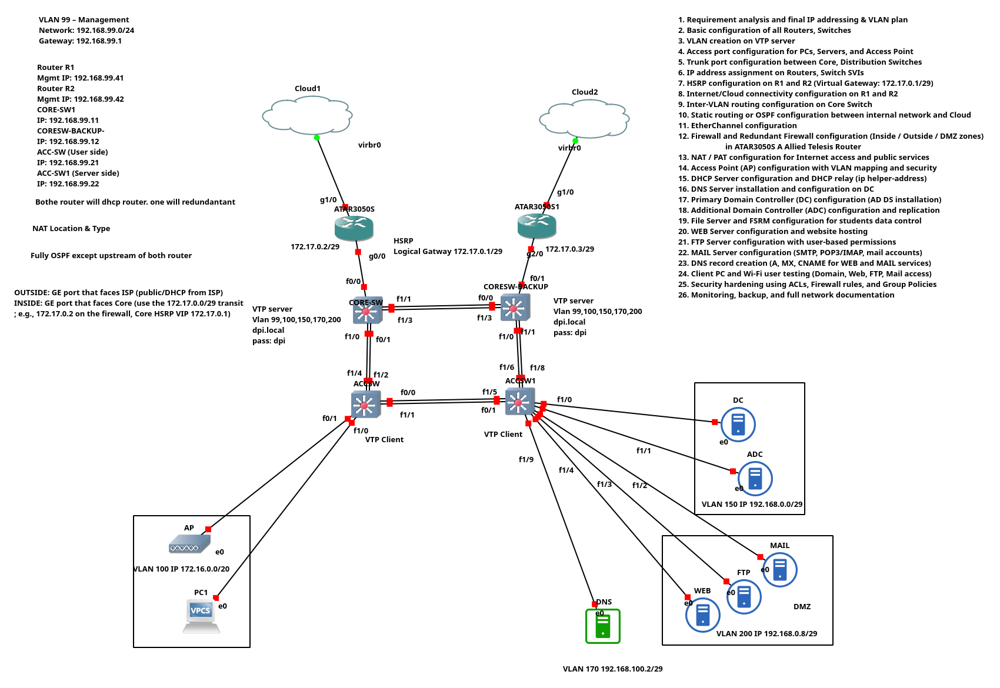
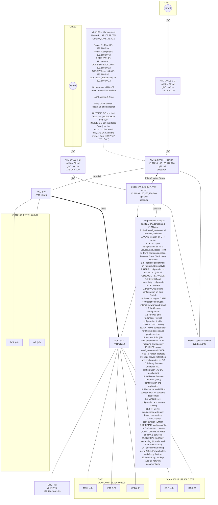

# Enterprise Network Infrastructure Project

<div align="center">


**Enterprise lab topology with dual-edge connectivity, redundant core, VLAN segmentation, DMZ services, and centralized identity/DNS**

[Topology](#-network-topology-overview) •
[IP Plan](#-vlan-plan--ip-addressing) •
[Switching](#-switching--vtp-trunking-etherchannel) •
[Routing & NAT](#-routing-hsrp-ospf--natpat) •
[Servers](#-server--service-setup) •
[Validation](#-verification--troubleshooting)

---

</div>

## 📷 Network Diagram

<div align="center">



*Enterprise Network Topology with Dual WAN, HSRP, and Segmented VLANs*

</div>

---
## 📌 Network Topology Overview

<table>
<tr>
<td width="50%">

### 🌐 Core Features
- ✅ Dual Internet/Cloud connectivity
- ✅ Redundant routers using **HSRP**
- ✅ Core, Distribution, and Access layers
- ✅ Redundant firewalls with failover
- ✅ EtherChannel for high-speed FTP traffic

</td>
<td width="50%">


</td>
</tr>
</table>
# **FULL NETWORK CONFIGURATION README.md**
> Topology + addressing + VLAN/VTP + trunks/EtherChannel + HSRP + OSPF + NAT/PAT + DHCP/DNS/AD/DC + DMZ services  
> Built to match the diagram exactly (names highlighted everywhere).


---

## **1. Topology Overview**
This lab contains:

- **2 Edge Routers**: **R1 (ATAR3050S)**, **R2 (ATAR3050S1)** connected to **Cloud1/Cloud2** (ISP/DHCP on outside)
- **2 Core Switches (L3)**: **CORE-SW1**, **CORE-SW-BACKUP**
- **2 Access Switches (L2)**: **ACC-SW (User side)**, **ACC-SW1 (Server side)**
- **Servers/Services**
  - **DC** (Domain Controller)
  - **ADC** (Additional Domain Controller)
  - **DNS** server
  - **DMZ servers**: **WEB**, **FTP**, **MAIL**
- **Wireless & Users**
  - **AP**
  - **PC1**

---

## **2. VLAN Plan & IP Addressing (From Diagram)**
### **VLAN 99 – Management**
- Network: **192.168.99.0/24**
- Gateway: **192.168.99.1**
- **R1 mgmt**: **192.168.99.41**
- **R2 mgmt**: **192.168.99.42**
- **CORE-SW1**: **192.168.99.11**
- **CORE-SW-BACKUP**: **192.168.99.12**
- **ACC-SW (User side)**: **192.168.99.21**
- **ACC-SW1 (Server side)**: **192.168.99.22**

### **Transit / Core-Edge segment**
- Network: **172.17.0.0/29**
- **HSRP Virtual Gateway**: **172.17.0.1/29**
- **R1 inside**: **172.17.0.2/29**
- **R2 inside**: **172.17.0.3/29**

### **VLAN 100 – Users / WiFi**
- Network: **172.16.0.0/20**
- Gateway (SVI): **172.16.0.1**

### **VLAN 150 – Domain Controllers**
- Network: **192.168.0.0/29**
- Gateway (SVI): **192.168.0.1**
- **DC**: **192.168.0.2**
- **ADC**: **192.168.0.3**

### **VLAN 170 – DNS**
- Network: **192.168.100.0/29**  
- Diagram note: **VLAN 170 192.168.100.2/29** (DNS host)
- Gateway (SVI): **192.168.100.1**
- **DNS**: **192.168.100.2**

### **VLAN 200 – DMZ**
- Network: **192.168.0.8/29**
- Gateway (SVI): **192.168.0.9**
- **WEB**: **192.168.0.10**
- **FTP**: **192.168.0.11**
- **MAIL**: **192.168.0.12**

---

## **3. VTP & VLAN Distribution**
- VTP domain: **dpi.local**
- VTP password: **dpi**
- **CORE-SW1**: **VTP Server**
- **CORE-SW-BACKUP**: **VTP Server**
- **ACC-SW**: **VTP Client**
- **ACC-SW1**: **VTP Client**
- VLANs carried by VTP: **99,100,150,170,200**

> Note: In real production, VTP is often avoided; but this README follows the diagram requirement.

---

## **4. Switching Architecture**
### **Trunks**
- Trunks between **CORE-SW1 ↔ CORE-SW-BACKUP**
- Trunks between **Core ↔ Access**
- Trunks carry: **VLAN 99,100,150,170,200**

### **EtherChannel**
- EtherChannel is used between **CORE-SW1 ↔ CORE-SW-BACKUP** (recommended LACP).

---

## **5. Routing Architecture**
- **Inter-VLAN routing** on **CORE-SW1/CORE-SW-BACKUP** via SVIs.
- **HSRP** for the **transit VLAN/interface 172.17.0.0/29** between **R1** and **R2**
  - Virtual IP: **172.17.0.1**
- **OSPF** internally (diagram: “Fully OSPF except upstream of both router”)
  - OSPF runs between **R1/R2** and **Core** for internal networks.
- Upstream (Cloud/ISP) uses **DHCP/public** on router outside interface.

---

## **6. NAT/PAT**
Diagram text:
- **OUTSIDE**: GE interface facing ISP (**public/DHCP from ISP**)
- **INSIDE**: GE interface facing Core (**172.17.0.0/29** transit)

Implementation:
- NAT overload (PAT) for inside VLANs to Internet
- Static NAT / Port-forward for public services in **DMZ (VLAN 200)** (WEB/FTP/MAIL)

---

## **7. Device Interface Map (As shown)**
### **R1 (ATAR3050S)**
- **g1/0** → **Cloud1** (outside, DHCP)
- **g0/0** → **CORE-SW1** (inside transit: **172.17.0.2/29**)

### **R2 (ATAR3050S1)**
- **g1/0** → **Cloud2** (outside, DHCP)
- **g2/0** → **CORE-SW-BACKUP** (inside transit: **172.17.0.3/29**)

### **CORE-SW1**
- **f0/0** uplink to **R1**
- **f0/1, f1/1** to **CORE-SW-BACKUP** (EtherChannel/trunk)
- **f1/0, f1/4, f1/2** downlinks to access (per diagram labels)
- **f0/1** downlink to **ACC-SW** (trunk)

### **CORE-SW-BACKUP**
- **f0/1** uplink to **R2**
- **f0/0, f1/3** to **CORE-SW1** (EtherChannel/trunk)
- **f1/6, f1/8** to access
- Multiple access ports toward servers/DMZ/DNS

### **ACC-SW (User side)**
- Uplink trunk to core
- Access ports to **AP** and **PC1** (VLAN 100)

### **ACC-SW1 (Server side)**
- Uplink trunk to core
- Access ports to **DC**, **ADC**, **WEB**, **FTP**, **MAIL**, **DNS** (VLANs 150/170/200)

---

## **8. FULL CONFIGURATION**
> Below is a full baseline Cisco-style configuration set.  
> Replace interface numbers if your simulator uses different naming, but keep **names/IPs/VLANs/HSRP/OSPF/NAT** as written.

---

# **8.1 CORE-SW1 Configuration (VTP SERVER + L3 + SVIs)**
```cisco
hostname CORE-SW1
no ip domain-lookup
ip domain-name dpi.local

username admin privilege 15 secret dpi
enable secret dpi

vtp domain dpi.local
vtp password dpi
vtp mode server
vtp version 2

spanning-tree mode rapid-pvst
spanning-tree vlan 99,100,150,170,200 root primary

!
! VLANs (created on VTP server)
vlan 99
 name VLAN99-MGMT
vlan 100
 name VLAN100-USERS
vlan 150
 name VLAN150-DC
vlan 170
 name VLAN170-DNS
vlan 200
 name VLAN200-DMZ
!

ip routing

!
! SVI Gateways
interface vlan 99
 description **MGMT-GW**
 ip address 192.168.99.1 255.255.255.0
 no shutdown

interface vlan 100
 description **USERS-GW**
 ip address 172.16.0.1 255.255.240.0
 no shutdown

interface vlan 150
 description **DC-GW**
 ip address 192.168.0.1 255.255.255.248
 no shutdown

interface vlan 170
 description **DNS-GW**
 ip address 192.168.100.1 255.255.255.248
 no shutdown

interface vlan 200
 description **DMZ-GW**
 ip address 192.168.0.9 255.255.255.248
 no shutdown

!
! Management address (device IP in VLAN 99)
interface vlan 99
 ip address 192.168.99.11 255.255.255.0
!

!
! Trunk/EtherChannel to CORE-SW-BACKUP (example: f0/1 + f1/1)
interface range f0/1, f1/1
 description **TO-CORE-SW-BACKUP-LACP**
 switchport trunk encapsulation dot1q
 switchport mode trunk
 switchport trunk allowed vlan 99,100,150,170,200
 channel-group 1 mode active

interface port-channel 1
 description **CORE-INTERLINK**
 switchport trunk encapsulation dot1q
 switchport mode trunk
 switchport trunk allowed vlan 99,100,150,170,200

!
! Trunk to ACC-SW (example: f1/0)
interface f1/0
 description **TO-ACC-SW-USER**
 switchport trunk encapsulation dot1q
 switchport mode trunk
 switchport trunk allowed vlan 99,100,150,170,200

!
! Trunk to ACC-SW1 (example: f1/2)
interface f1/2
 description **TO-ACC-SW1-SERVER**
 switchport trunk encapsulation dot1q
 switchport mode trunk
 switchport trunk allowed vlan 99,100,150,170,200

!
! Transit to R1 (routed port) - if supported
interface f0/0
 description **TO-R1-TRANSIT**
 no switchport
 ip address 172.17.0.4 255.255.255.248
 no shutdown

!
router ospf 10
 router-id 1.1.1.1
 passive-interface default
 no passive-interface f0/0
 network 172.16.0.0 0.0.15.255 area 0
 network 192.168.0.0 0.0.0.255 area 0
 network 192.168.99.0 0.0.0.255 area 0
 network 192.168.100.0 0.0.0.7 area 0
 network 172.17.0.0 0.0.0.7 area 0
!

line vty 0 4
 login local
 transport input ssh
!
crypto key generate rsa modulus 2048
ip ssh version 2
```

> Note: Some platforms do not allow two IPs on the same SVI; if so, keep **192.168.99.11** on VLAN99 and ensure the gateway **192.168.99.1** is provided by HSRP on cores instead. The diagram states gateway **192.168.99.1**; the clean design is HSRP on VLAN99 at the core. See the optional section **8.1.1** below.

---

## **8.1.1 Optional (Recommended) HSRP for VLAN 99 at Core**
If you want **gateway 192.168.99.1** without conflict:

- **CORE-SW1 VLAN99** = 192.168.99.11
- **CORE-SW-BACKUP VLAN99** = 192.168.99.12
- **HSRP VIP** = 192.168.99.1

(HSRP config shown under **CORE-SW-BACKUP** too.)

---

# **8.2 CORE-SW-BACKUP Configuration (VTP SERVER + L3 + SVIs)**
```cisco
hostname CORE-SW-BACKUP
no ip domain-lookup
ip domain-name dpi.local

username admin privilege 15 secret dpi
enable secret dpi

vtp domain dpi.local
vtp password dpi
vtp mode server
vtp version 2

spanning-tree mode rapid-pvst
spanning-tree vlan 99,100,150,170,200 root secondary

ip routing

!
! Device management IP on VLAN99
interface vlan 99
 description MGMT
 ip address 192.168.99.12 255.255.255.0
 no shutdown

!
! (Optional) HSRP for VLAN99 gateway 192.168.99.1
standby version 2
interface vlan 99
 standby 99 ip 192.168.99.1
 standby 99 priority 110
 standby 99 preempt

!
! SVIs (same gateways if not using HSRP per-VLAN; or configure HSRP per VLAN)
interface vlan 100
 ip address 172.16.0.2 255.255.240.0
 no shutdown
interface vlan 150
 ip address 192.168.0.4 255.255.255.248
 no shutdown
interface vlan 170
 ip address 192.168.100.4 255.255.255.248
 no shutdown
interface vlan 200
 ip address 192.168.0.13 255.255.255.248
 no shutdown

!
! EtherChannel to CORE-SW1 (example f0/0 + f1/3)
interface range f0/0, f1/3
 description TO-CORE-SW1-LACP
 switchport trunk encapsulation dot1q
 switchport mode trunk
 switchport trunk allowed vlan 99,100,150,170,200
 channel-group 1 mode active

interface port-channel 1
 description CORE-INTERLINK
 switchport trunk encapsulation dot1q
 switchport mode trunk
 switchport trunk allowed vlan 99,100,150,170,200

!
! Trunks to access
interface f1/6
 description TO-ACC-SW
 switchport trunk encapsulation dot1q
 switchport mode trunk
 switchport trunk allowed vlan 99,100,150,170,200

interface f1/8
 description TO-ACC-SW1
 switchport trunk encapsulation dot1q
 switchport mode trunk
 switchport trunk allowed vlan 99,100,150,170,200

!
! Transit to R2 (routed port)
interface f0/1
 description TO-R2-TRANSIT
 no switchport
 ip address 172.17.0.5 255.255.255.248
 no shutdown

router ospf 10
 router-id 2.2.2.2
 passive-interface default
 no passive-interface f0/1
 network 172.16.0.0 0.0.15.255 area 0
 network 192.168.0.0 0.0.0.255 area 0
 network 192.168.99.0 0.0.0.255 area 0
 network 192.168.100.0 0.0.0.7 area 0
 network 172.17.0.0 0.0.0.7 area 0
```

---

# **8.3 ACC-SW Configuration (VTP CLIENT, USER ACCESS)**
```cisco
hostname ACC-SW
no ip domain-lookup
ip domain-name dpi.local

username admin privilege 15 secret dpi
enable secret dpi

vtp domain dpi.local
vtp password dpi
vtp mode client
vtp version 2

spanning-tree mode rapid-pvst

!
interface vlan 99
 description **MGMT**
 ip address 192.168.99.21 255.255.255.0
 no shutdown
ip default-gateway 192.168.99.1

!
! Uplink trunk to core (example f0/0)
interface f0/0
 description **UPLINK-TO-CORE**
 switchport trunk encapsulation dot1q
 switchport mode trunk
 switchport trunk allowed vlan 99,100,150,170,200

!
! Access ports
interface f0/1
 description **TO-AP**
 switchport mode access
 switchport access vlan 100
 spanning-tree portfast

interface f1/0
 description **TO-PC1**
 switchport mode access
 switchport access vlan 100
 spanning-tree portfast
```

---

# **8.4 ACC-SW1 Configuration (VTP CLIENT, SERVER ACCESS)**
```cisco
hostname ACC-SW1
no ip domain-lookup
ip domain-name dpi.local

username admin privilege 15 secret dpi
enable secret dpi

vtp domain dpi.local
vtp password dpi
vtp mode client
vtp version 2

spanning-tree mode rapid-pvst

interface vlan 99
 description **MGMT**
 ip address 192.168.99.22 255.255.255.0
 no shutdown
ip default-gateway 192.168.99.1

!
interface f0/0
 description **UPLINK-TO-CORE**
 switchport trunk encapsulation dot1q
 switchport mode trunk
 switchport trunk allowed vlan 99,100,150,170,200

!
! Server access ports (examples; map to your actual cabling)
interface f0/1
 description **TO-DC**
 switchport mode access
 switchport access vlan 150
 spanning-tree portfast

interface f0/2
 description **TO-ADC**
 switchport mode access
 switchport access vlan 150
 spanning-tree portfast

interface f0/3
 description **TO-DNS**
 switchport mode access
 switchport access vlan 170
 spanning-tree portfast

interface f0/4
 description **TO-WEB**
 switchport mode access
 switchport access vlan 200
 spanning-tree portfast

interface f0/5
 description **TO-FTP**
 switchport mode access
 switchport access vlan 200
 spanning-tree portfast

interface f0/6
 description **TO-MAIL**
 switchport mode access
 switchport access vlan 200
 spanning-tree portfast
```

---

# **8.5 R1 Configuration (ATAR3050S) – HSRP + OSPF + NAT**
```cisco
hostname R1-ATAR3050S
no ip domain-lookup

!
! Outside to ISP/Cloud1
interface g1/0
 description **OUTSIDE-TO-CLOUD1**
 ip address dhcp
 ip nat outside
 no shutdown

!
! Inside to Core transit
interface g0/0
 description **INSIDE-TO-CORE-TRANSIT**
 ip address 172.17.0.2 255.255.255.248
 ip nat inside
 standby version 2
 standby 1 ip 172.17.0.1
 standby 1 priority 110
 standby 1 preempt
 no shutdown

!
! OSPF internal
router ospf 10
 router-id 10.10.10.1
 network 172.17.0.0 0.0.0.7 area 0

!
! Default route toward ISP learned by DHCP (common) or set static:
! ip route 0.0.0.0 0.0.0.0 dhcp

!
! NAT Overload for internal networks
access-list 10 permit 172.16.0.0 0.0.15.255
access-list 10 permit 192.168.0.0 0.0.0.255
access-list 10 permit 192.168.99.0 0.0.0.255
access-list 10 permit 192.168.100.0 0.0.0.7

ip nat inside source list 10 interface g1/0 overload

!
! Example port-forwards to DMZ (adjust public ports as desired)
! HTTP -> WEB (192.168.0.10)
ip nat inside source static tcp 192.168.0.10 80 interface g1/0 80
! FTP -> FTP (192.168.0.11)
ip nat inside source static tcp 192.168.0.11 21 interface g1/0 21
! SMTP -> MAIL (192.168.0.12)
ip nat inside source static tcp 192.168.0.12 25 interface g1/0 25
```

---

# **8.6 R2 Configuration (ATAR3050S1) – HSRP + OSPF + NAT**
```cisco
hostname R2-ATAR3050S1
no ip domain-lookup

interface g1/0
 description **OUTSIDE-TO-CLOUD2**
 ip address dhcp
 ip nat outside
 no shutdown

interface g2/0
 description **INSIDE-TO-CORE-TRANSIT**
 ip address 172.17.0.3 255.255.255.248
 ip nat inside
 standby version 2
 standby 1 ip 172.17.0.1
 standby 1 priority 100
 standby 1 preempt
 no shutdown

router ospf 10
 router-id 10.10.10.2
 network 172.17.0.0 0.0.0.7 area 0

access-list 10 permit 172.16.0.0 0.0.15.255
access-list 10 permit 192.168.0.0 0.0.0.255
access-list 10 permit 192.168.99.0 0.0.0.255
access-list 10 permit 192.168.100.0 0.0.0.7

ip nat inside source list 10 interface g1/0 overload
```

---

## **9. DHCP Configuration**
Diagram says: “Both router will dhcp router. one will redundant”.

### **Recommended design**
- Put DHCP on **R1** for VLAN100/150/170/200 (scopes)
- Put DHCP on **R2** as backup (identical pools, but keep disabled unless failover is manual)

### **R1 DHCP**
```cisco
service dhcp

ip dhcp excluded-address 172.16.0.1 172.16.0.50
ip dhcp excluded-address 192.168.0.1 192.168.0.4
ip dhcp excluded-address 192.168.0.9 192.168.0.13
ip dhcp excluded-address 192.168.100.1 192.168.100.2
ip dhcp excluded-address 192.168.99.1 192.168.99.50

ip dhcp pool VLAN100-USERS
 network 172.16.0.0 255.255.240.0
 default-router 172.16.0.1
 dns-server 192.168.100.2
 domain-name dpi.local

ip dhcp pool VLAN150-DC
 network 192.168.0.0 255.255.255.248
 default-router 192.168.0.1
 dns-server 192.168.100.2
 domain-name dpi.local

ip dhcp pool VLAN170-DNS
 network 192.168.100.0 255.255.255.248
 default-router 192.168.100.1
 dns-server 192.168.100.2
 domain-name dpi.local

ip dhcp pool VLAN200-DMZ
 network 192.168.0.8 255.255.255.248
 default-router 192.168.0.9
 dns-server 192.168.100.2
 domain-name dpi.local
```

> If DHCP is instead hosted on **DC**, then configure `ip helper-address 192.168.0.2` on each SVI on the core switches.

---

## **10. Server Configurations**
### **DC (VLAN 150)**
- Hostname: **DC**
- IP: **192.168.0.2/29**
- GW: **192.168.0.1**
- DNS: **192.168.100.2** (or itself after DNS is installed)

Roles:
- **AD DS**
- **DNS** (optional if you want DNS on DC, but diagram shows separate **DNS** server)

### **ADC (VLAN 150)**
- Hostname: **ADC**
- IP: **192.168.0.3/29**
- GW: **192.168.0.1**
- DNS: **192.168.100.2**
Roles:
- Additional Domain Controller
- AD-integrated replication

### **DNS (VLAN 170)**
- Hostname: **DNS**
- IP: **192.168.100.2/29**
- GW: **192.168.100.1**
Zones/Records:
- Zone: **dpi.local**
- A records: **dc**, **adc**, **dns**, **web**, **ftp**, **mail**
- MX record: **mail.dpi.local**

### **DMZ Servers (VLAN 200)**
- **WEB**: **192.168.0.10/29**, GW **192.168.0.9**
- **FTP**: **192.168.0.11/29**, GW **192.168.0.9**
- **MAIL**: **192.168.0.12/29**, GW **192.168.0.9**

Services:
- WEB: HTTP/HTTPS site hosting
- FTP: user-based FTP permissions
- MAIL: SMTP/IMAP/POP3 as needed

---

## **11. Wireless & User Hosts**
### **AP (VLAN 100)**
- Management IP: DHCP from **VLAN100**
- SSID mapped to **VLAN 100**
- WPA2/WPA3 recommended, or lab-open

### **PC1 (VLAN 100)**
- DHCP client
- Must resolve **dpi.local** via **DNS (192.168.100.2)**

---

## **12. Validation Checklist**
Run these tests:

### **Switching**
- `show vtp status` on **CORE-SW1**, **CORE-SW-BACKUP**, **ACC-SW**, **ACC-SW1**
- `show interfaces trunk`
- `show etherchannel summary`
- `show spanning-tree vlan 99,100,150,170,200`

### **Routing/Redundancy**
- `show standby brief` on **R1** and **R2**
- `show ip ospf neighbor` on routers and cores
- Ping:
  - **PC1 → 172.16.0.1**
  - **PC1 → 192.168.100.2**
  - **PC1 → 192.168.0.2**
  - **PC1 → Internet**

### **NAT**
- `show ip nat translations`
- From **PC1** browse to router public IP to reach **WEB** (port-forward)

---

## 📝 Author

<div align="center">

**Shuvo**

*Enterprise Networking & Server Infrastructure Project*

[](https://github.com/devshuvocse/)
[](https://www.linkedin.com/in/ahashanul-haque-shuvo)

---

<sub>📅 Last Updated: Dec 2025 | 📖 Documentation v1.4</sub>

</div>

---

## 📄 License

This project is licensed under the MIT License - see the [LICENSE](LICENSE) file for details.

---

---
```
